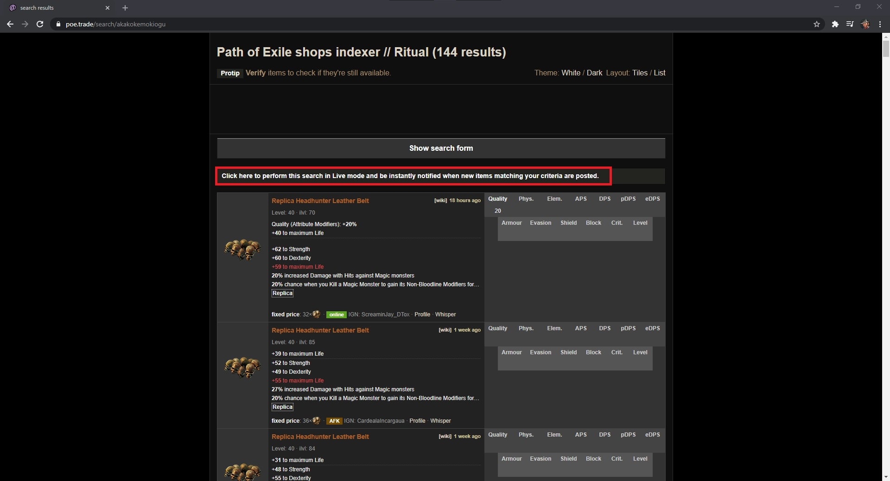
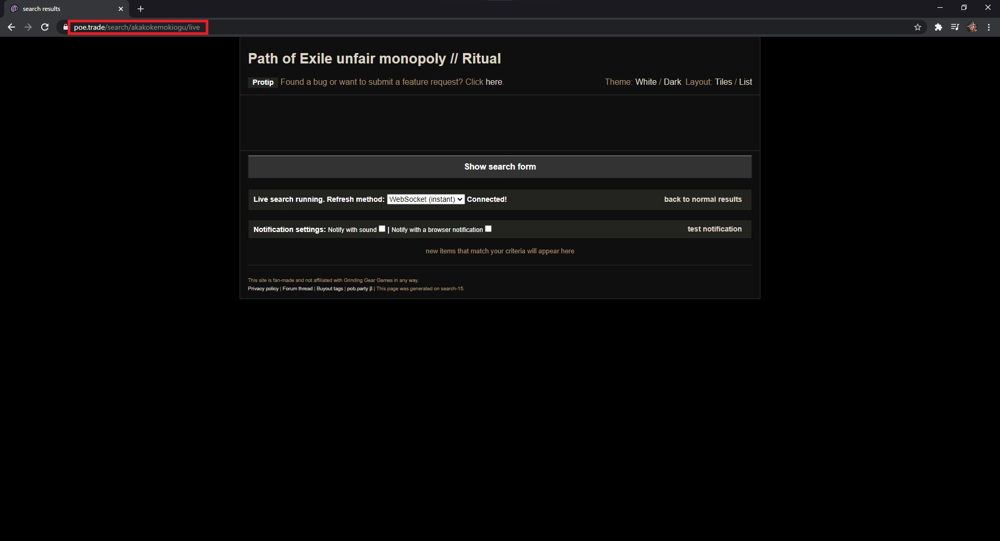
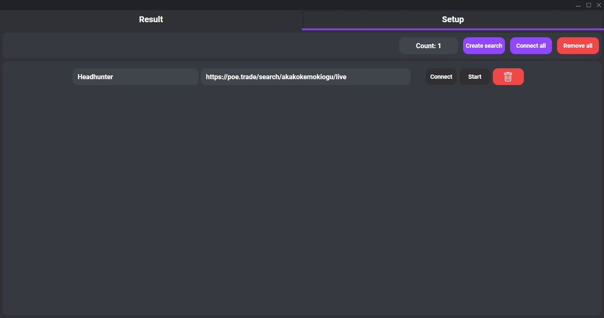
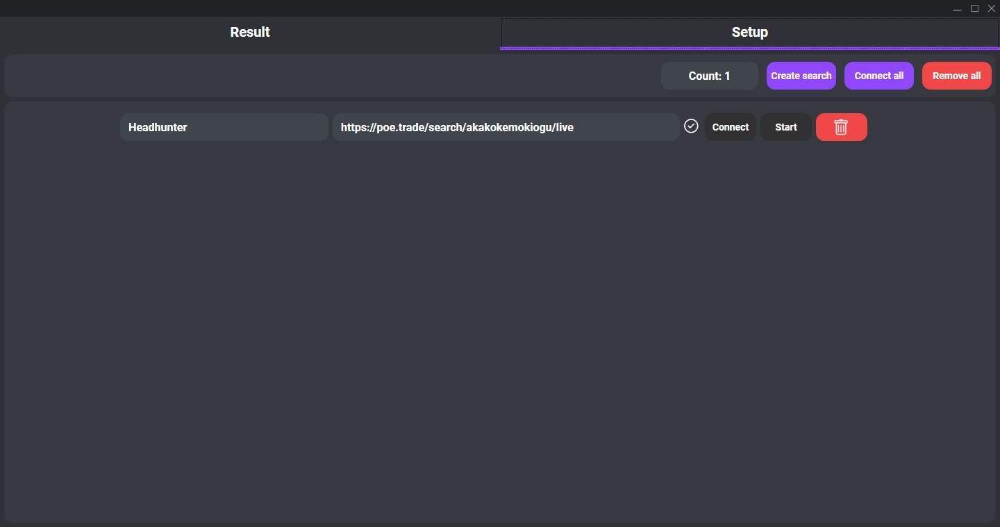

# PoeSniper

Poesniper is a program that allows you to automate the process of live search on [poe.trade](https://poe.trade/).

## How to use

1. You need to go to [poe.trade](https://poe.trade/) and find the item you are interested in with the necessary filters.
2. Next you need to activate live search.

Then copy the link. You can close the tab, you won't need it anymore.

3. Create a search, paste the link in the URL field, come up with a name, and click connect.

4. After the download is complete, click start. 

Live search is running. The search results will be displayed in the results tab. Each new search result will send a notification to the notification center. All you need to do is simply paste the result into the game chat (ctrl + v) when the notification arrives.

## Safety

Since the program does not interact with the path of exile client in any way, and all it does is simplify the work with live search by automatically copying the trade messages to the clipboard, it does not violate anything.

## Required

* Windows 10 1903 version (x64 only)
* Microsoft .NET 5
* Microsoft Visual C++ 2015-2019 Redistributable